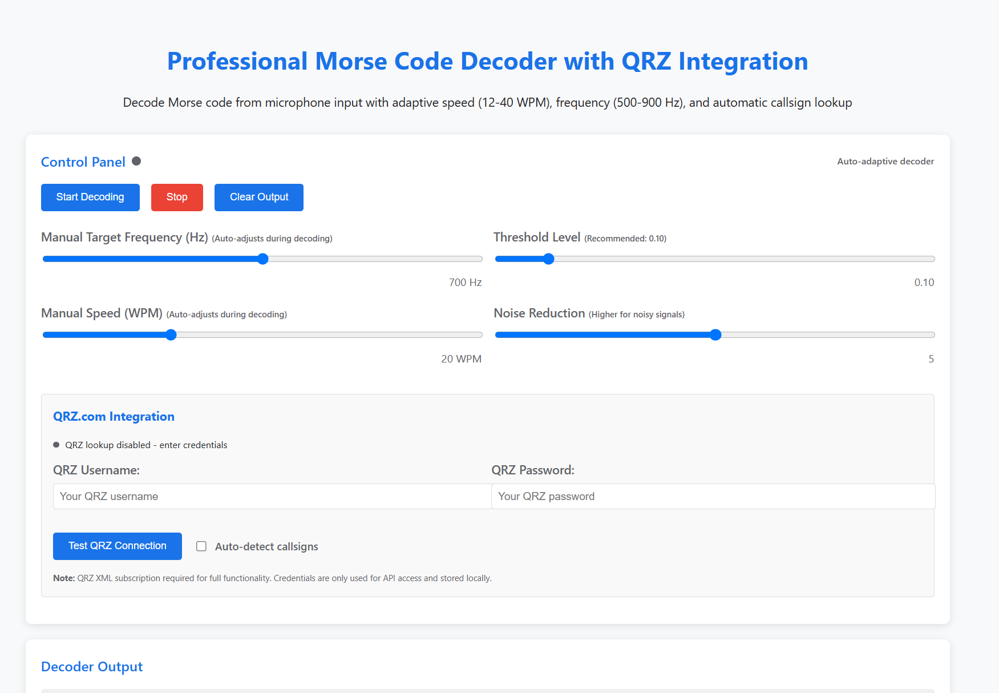
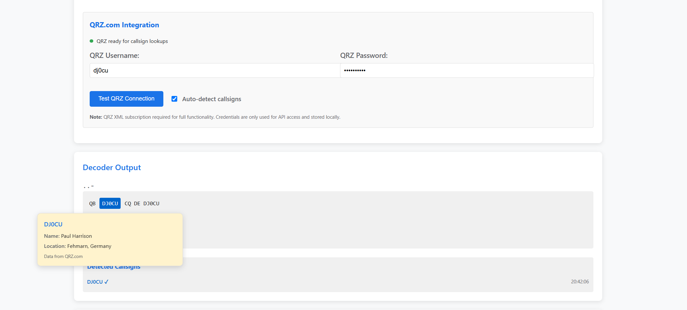

# Enhanced Morse Code Decoder with QRZ Integration

A professional-grade Morse code decoder that automatically detects amateur radio callsigns and provides instant QRZ.com lookups with detailed station information.

## Screenshots

*Main decoder interface with real-time waveform and spectrum analysis*

 
*QRZ integration showing automatic callsign detection with info bubbles*

## Live Demo

🔗 **[Try the Enhanced Morse Decoder](https://sparks72.github.io/Morse-decoding-with-LLMs/enhanced-morse-decoder.html)**

## Features

### 🎧 Advanced Morse Decoding
- **Adaptive Speed Detection** (12-40 WPM)
- **Auto-Frequency Tuning** (500-900 Hz range)
- **Real-time Goertzel tone detection**
- **Noise reduction and SNR analysis**
- **Visual waveform and spectrum displays**

### 📡 QRZ.com Integration
- **Automatic callsign detection** with ITU validation
- **Interactive info bubbles** with station details
- **Connecting lines** between callsigns and data
- **Smart querying** (only after complete words)
- **Special event station support** (multiple digits)
- **Auto-detection toggle** (off by default)

### 🎛️ Professional Features
- **Keyboard shortcuts** (Spacebar = start/stop, Ctrl+C = clear)
- **Responsive design** for desktop and mobile
- **Real-time confidence indicators**
- **Session memory** for QRZ credentials
- **Audio stream interruption recovery**

## Usage

1. **Open** the [live demo](https://sparks72.github.io/Morse-decoding-with-LLMs/enhanced-morse-decoder.html) or download the HTML file
2. **Grant microphone permission** when prompted
3. **Configure QRZ credentials** (optional, requires XML subscription)
4. **Enable auto-callsign detection** if desired
5. **Click "Start Decoding"** or press spacebar
6. **Play Morse code** - audio will be decoded in real-time
7. **Click highlighted callsigns** to see QRZ data bubbles

## Requirements

- Modern web browser with microphone access
- QRZ.com XML subscription (for callsign lookups)
- Audio source (microphone, radio, or audio interface)

## Technical Details

- **Pure HTML/CSS/JavaScript** - no external dependencies
- **Goertzel algorithm** for precise tone detection
- **ITU amateur radio callsign validation**
- **CORS proxy** for QRZ API access (production deployment needs proper proxy)

## Ham Radio Optimized

Designed by amateur radio operators for amateur radio operators, with attention to:
- Real-world operating conditions
- Contest and DX scenarios  
- Portable/mobile operations
- Training and practice modes

## Project Links

- **Main Repository**: [Morse-decoding-with-LLMs](https://github.com/Sparks72/Morse-decoding-with-LLMs)
- **QRZ Integration Branch**: [QRZ-Integration](https://github.com/Sparks72/Morse-decoding-with-LLMs/tree/QRZ-Integration)
- **Live Demo**: [Enhanced Decoder](https://sparks72.github.io/Morse-decoding-with-LLMs/enhanced-morse-decoder.html)

## Contributing

This project welcomes contributions from the amateur radio community. Feel free to submit issues or pull requests.

## License

Open source - free for amateur radio use

---
**73!** 📻
